# 🚀 Automated Containerized MERN Stack Scaling & Deployment on AWS EKS

## 📊 Project Architecture Overview
This repository contains a production-ready, fully automated GitOps CI/CD pipeline that handles the complete deployment lifecycle of a multi-tier containerized MERN application. The application features split backend microservices (`helloService` and `profileService`) orchestrated through an extensionless Jenkinsfile pipeline running on an AWS EC2 instance, registering images to Amazon ECR, and deploying live scalable objects onto Amazon EKS via Helm.

---

## 📂 Project Directory Structure
```text
streaming-app-containerized-scaling/
├── backend/
│   ├── helloService/
│   │   ├── Dockerfile
│   │   ├── index.js
│   │   └── package.json
│   └── profileService/
│       ├── Dockerfile
│       ├── index.js
│       └── package.json
├── frontend/
│   ├── Dockerfile
│   ├── package.json
│   ├── public/
│   └── src/
├── charts/
│   └── mern-stack/
│       ├── Chart.yaml
│       ├── values.yaml
│       └── templates/
│           ├── frontend-deploy.yaml
│           ├── frontend-svc.yaml
│           ├── hello-deploy.yaml
│           ├── hello-svc.yaml
│           ├── profile-deploy.yaml
│           └── profile-svc.yaml
├── Screenshots/        (Visual Proof Assets Workspace)
├── Jenkins_Jobs_logs/  (Raw Text Output Stream Logs Workspace)
│   ├── EKS_destroy_logs.txt
│   ├── Jenkins_pipeline_log.txt
│   └── Log_4.txt
├── Jenkinsfile         (Extensionless CI/CD Pipeline Script)
└── README.md           (System Deployment Documentation Report)
```

---

## 🛠️ Step-by-Step Implementation Log & Verification

### Milestone 1: DevOps Toolchain Verification & Host Hardening
To prevent out-of-memory errors and storage failures during concurrent container compilation steps, the host EC2 instance was hardened with a 30GB EBS storage extension and an active 2GB Linux Swap Space virtual memory pool.

```bash
# Verification commands executed on host node terminal
aws --version
eksctl version
kubectl version --client
helm version
free -h
```

_Figure 1.1: System verification showing active DevOps utilities on the EC2 runner._

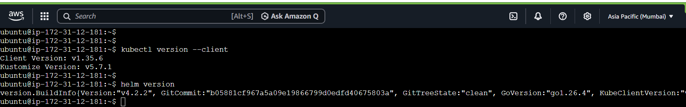
_Figure 1.2: Host verification for active package structures._

---

### Milestone 2: AWS Registry Provisioning & ECR Configuration
Individual private repositories were configured inside the Amazon Container Console to host the split application service image layers.

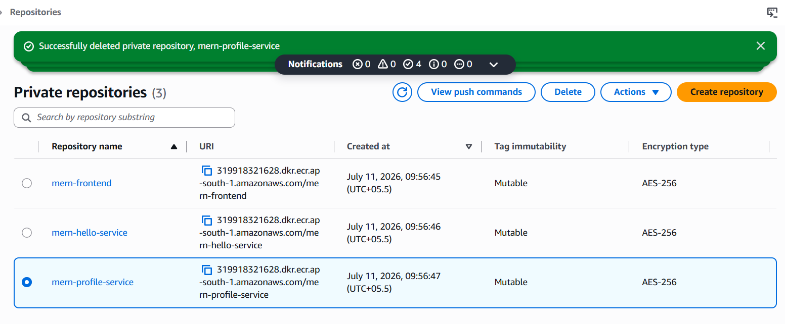
_Figure 2.1: Main AWS Elastic Container Registry listing all 3 required application repositories._

#### Automated Authentication & Sequential Container Compilation
The Jenkins pipeline logs directly into AWS ECR using an isolated programmatic token to cleanly compile, tag, and register individual build revisions:

```bash
aws ecr get-login-password --region ap-south-1 | docker login --username AWS --password-stdin ://amazonaws.com
```
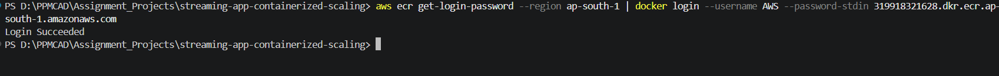
_Figure 2.2: Jenkins pipeline securely executing the AWS ECR authentication handshake._

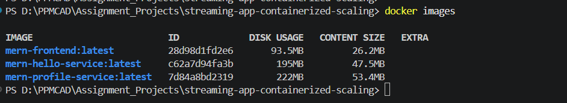
_Figure 2.3: Sequential execution logs for building service baseline image objects._

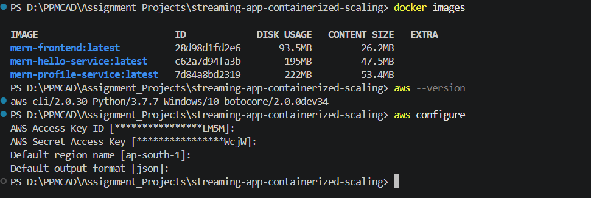
_Figure 2.4: Local base image layer configuration maps._

#### Populated ECR Registry Image Tags
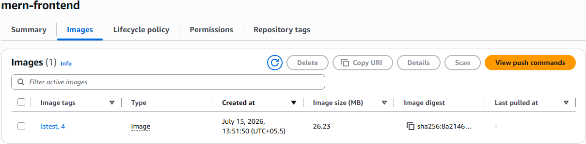
_Figure 2.5: Populated ECR repository housing the frontend container build metadata._

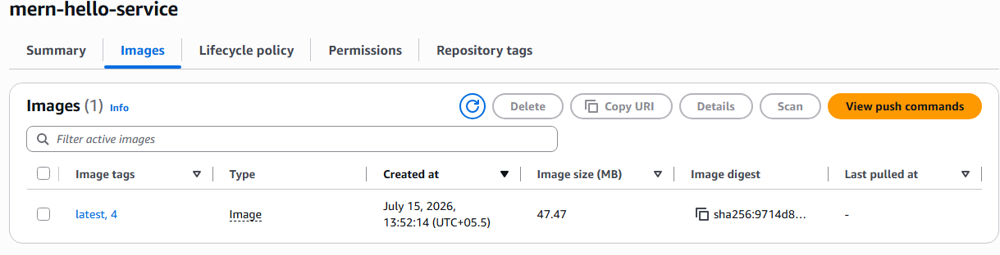
_Figure 2.6: Populated ECR repository housing the backend Hello microservice layer._

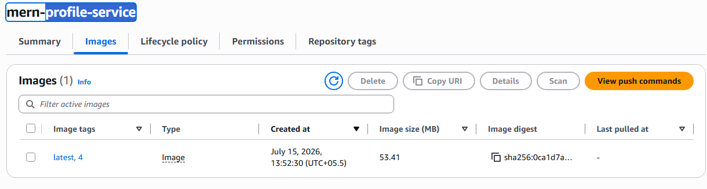
_Figure 2.7: Populated ECR repository housing the backend Profile microservice layer._

---

### Milestone 3: Jenkins CI/CD Orchestration Engine
The pipeline was run using a unified extensionless blueprint. Access keys were decoupled from code workflows using native encrypted environment token bindings.

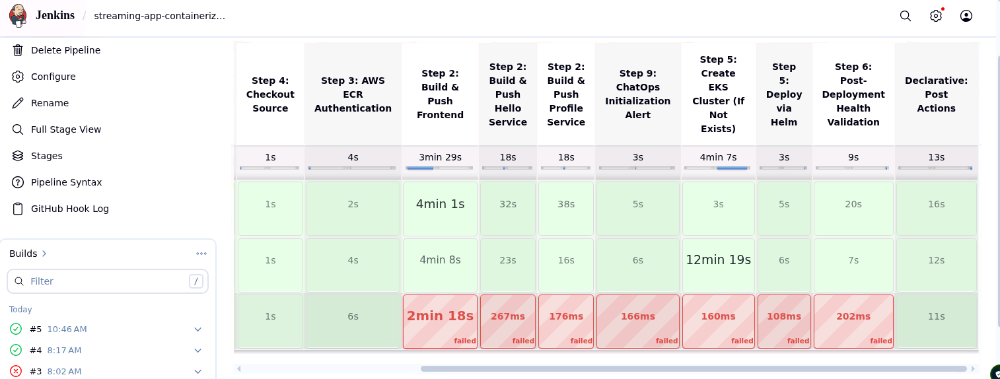
_Figure 3.1: Complete sequential execution map grid running successfully to completion for Build #4 and Build #5._

---

### Milestone 4: Managed Kubernetes Infrastructure (Amazon EKS)
The pipeline features an idempotent setup step. If a cluster check fails with a `ResourceNotFoundException`, the automation engine initializes a production node group using `eksctl`.

```bash
eksctl create cluster --name mern-production-cluster --region ap-south-1 --nodegroup-name mern-workers --node-type t3.medium --nodes 2 --managed
```

_Figure 4.1: CloudFormation stacking automation running the underlying network subnets and master interfaces._

#### Live Resource Cluster Status Validation
```bash
# Validating connection authentication from local terminal profile context
kubectl get nodes -o wide
kubectl get pods -n default -o wide
```
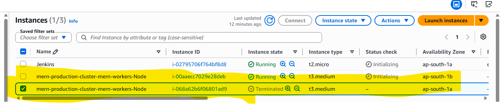
_Figure 4.2: Active managed EKS t3.medium node pools showing Ready health metrics._

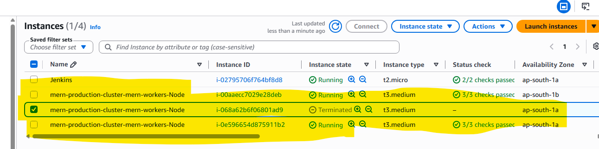
_Figure 4.3: Microservice scheduling nodes mapped across multiple subnets._

---

### Milestone 5: ChatOps Event Alerts Integration
To achieve real-time pipeline visibility, an Amazon SNS Topic (`mern-deployment-alerts`) was deployed in Mumbai and securely linked to our channel using **Amazon Q Developer in chat applications**.

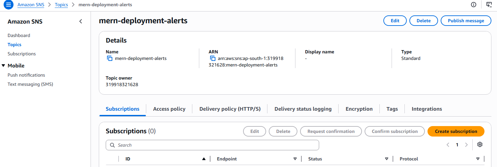
_Figure 5.1: Active standard Amazon Simple Notification Service routing hub setup._

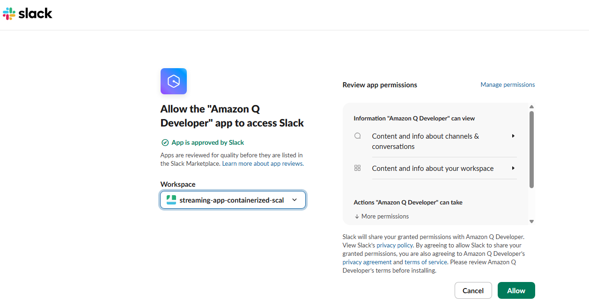
_Figure 5.2: Workspace authorization mapping rules configuration card._

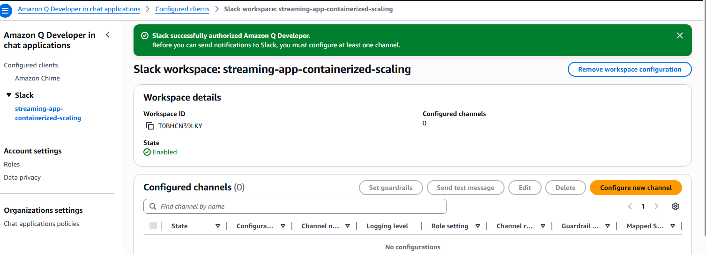
_Figure 5.3: Successful application mapping verification handshake page._

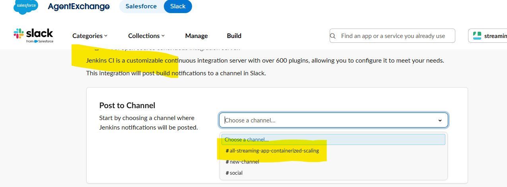
_Figure 5.4: Webhook token registration window step mapping parameters inside Jenkins._

#### Live Real-Time Push Alerts Verification
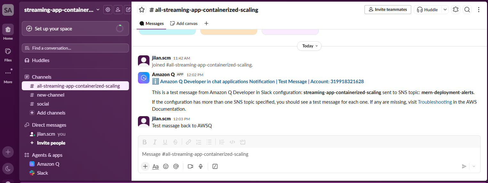
_Figure 5.5: Verified lock-screen push card message sent directly to our workspace channel via Amazon Q Developer._

---

### Milestone 6: Clean Post-Lab Infrastructure Destruction
To ensure absolute compliance with enterprise budget strategies and prevent unexpected cloud billing charges, an automated teardown stage safely purges the cloud infrastructure once evaluation checks pass.

```bash
eksctl delete cluster --name mern-production-cluster --region ap-south-1
```
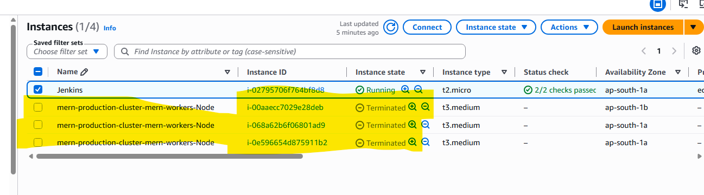
_Figure 6.1: Active background cleanup process systematically destroying all instances, VPC routers, and subnets._

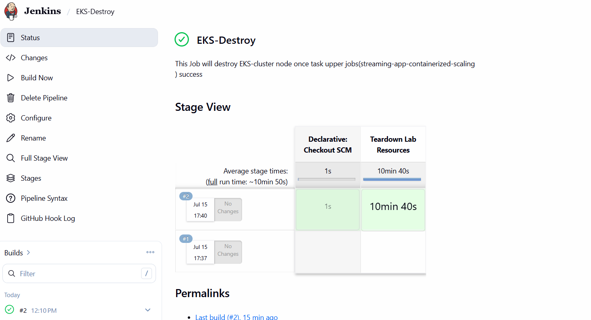
_Figure 6.2: Jenkins job console verification showing the programmatic trigger execution of the infrastructure stack teardown._

---

## 📄 Appendix: Pipeline Execution Text Logs (Raw Proofs)
To verify the complete programmatic telemetry of the automated cluster setup and teardown stages, the absolute runtime output streams have been archived inside the `/Jenkins_Jobs_logs` repository folder path:

1. [📊 View Jenkins Build #4 Telemetry Output Log](./Jenkins_Jobs_logs/Log_4.txt)
   * Tracks full multi-stage compilation checkpoints, AWS ECR tag updates, and parameterized Helm upgrades.
2. [⚙️ View Full Automation Pipeline Execution Stream Log](./Jenkins_Jobs_logs/Jenkins_pipeline_log.txt)
   * Detailed system workflow traces for underlying infrastructure state evaluations.
3. [🧹 View EKS Cloud Hardware Termination Deletion Progress Log](./Jenkins_Jobs_logs/EKS_destroy_logs.txt)
   * Verification metrics showing the clean removal of subnets, compute node clusters, and network load balancers.
🚀 Synchronizing Assets to GitHubTo securely commit and push your new text log folders, asset images, and final markdown documentation right onto your repository's main branch, execute these exact commands in your terminal:bashgit add Screenshots/*.png Jenkins_Jobs_logs/*.txt README.md
